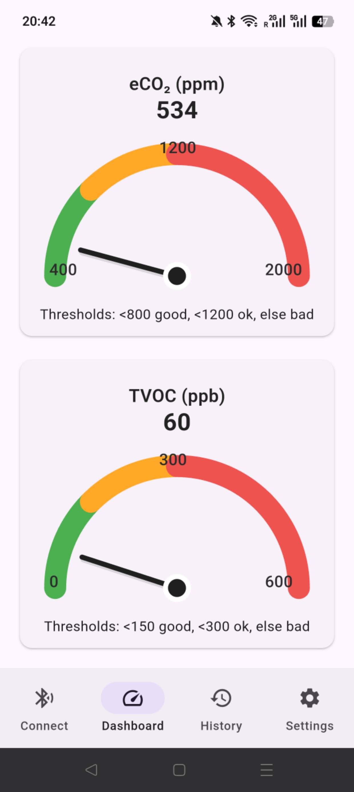
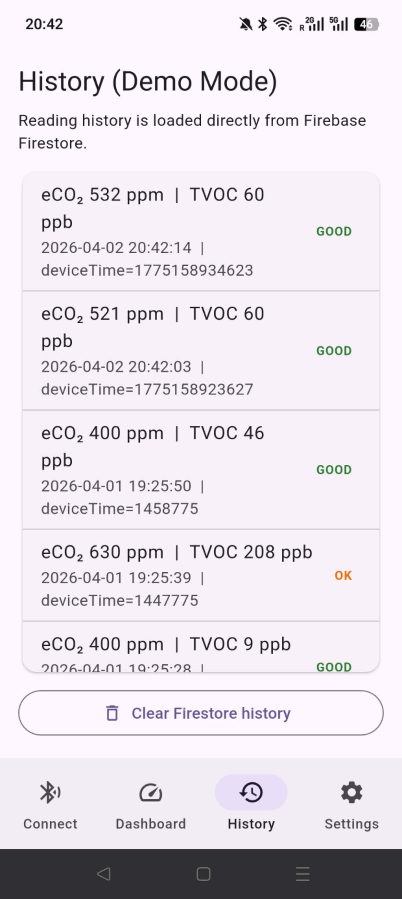
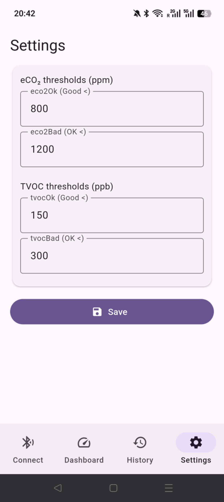

# CASA0015 – Smart Indoor Air Quality (IAQ) Monitoring System

> **Making the Invisible Actionable: A narrative-driven approach to environmental well-being.**

---

## 📖 The Narrative & Storytelling
[cite_start]*This section addresses the "Exploratory & Storytelling" assessment criteria (20%)[cite: 55, 99].*

### 🔴 The Problem Statement
[cite_start]Indoor air quality is an "invisible threat" that directly impacts cognitive performance and long-term health[cite: 38]. [cite_start]Existing tools often provide raw, complex data (e.g., 1200ppm eCO₂) that fails to motivate action for non-technical users[cite: 4, 32]. [cite_start]This project bridges that gap by translating invisible chemical concentrations into intuitive, glanceable feedback[cite: 5].

### 👤 User Persona: "The Focused Student"
* [cite_start]**Name:** Alex [cite: 99]
* [cite_start]**Context:** A university student spending 8+ hours a day in various campus library pods and seminar rooms[cite: 4, 99].
* [cite_start]**Pain Point:** Alex often feels unexplained fatigue and headaches during long study sessions but cannot determine if the cause is poor room ventilation or just exhaustion[cite: 99].

### 🗺️ The User Journey (Storyboard)
1.  [cite_start]**Discovery:** Alex enters a study pod and connects the IAQ sensor via the app's **BLE Discovery** page[cite: 42, 99].
2.  [cite_start]**Awareness:** Through the **Gauge-style Dashboard**, the app translates complex eCO₂ levels into a "Bad" (Red) status, providing an immediate visual cue[cite: 99].
3.  [cite_start]**Action:** The app's **Real-time Feedback** motivates Alex to crack a window or increase ventilation[cite: 43].
4.  [cite_start]**Reflection:** Alex checks the **Historical Data** (backed by Firebase) to identify if specific rooms consistently have poor air quality for future study sessions[cite: 19, 99].

---

## 🛠️ System Architecture & Technical Integration
[cite_start]*Demonstrating the full extent of Flutter knowledge and cloud service integration[cite: 44, 100].*

### 🔄 The Seamless Ecosystem
[cite_start]The project follows a robust three-layer architecture designed for stability and cross-device access[cite: 18, 100]:

1.  [cite_start]**Sense (Physical Layer):** An **Arduino** (Nano 33 IoT) equipped with an **SGP30 sensor** measures eCO₂ and TVOC[cite: 17, 98].
2.  [cite_start]**Transmit (Communication Layer):** Real-time readings are transmitted wirelessly via **Bluetooth Low Energy (BLE)**[cite: 4, 48].
3.  **Visualize & Remember (Digital Layer):**
    * [cite_start]**Flutter App:** Processes raw bytes and visualizes them using custom widgets[cite: 46, 99].
    * [cite_start]**Firebase Firestore:** Acts as the "Environmental Memory," providing persistent cloud storage for long-term trend analysis[cite: 56, 100].

---

## 🧠 Application Functionality

### 🔍 1. Device Discovery & Connection
[cite_start]The app handles the full BLE lifecycle, including scanning, signal strength (RSSI) monitoring, and connection management[cite: 8, 98].

  

### 📊 2. Real-Time Dashboard
[cite_start]The dashboard provides **Cognitive Offloading** by classifying air quality into Good, OK, or Bad status based on scientific thresholds[cite: 98].

  

### 🕓 3. Historical Data Tracking
[cite_start]Timestamped records are retrieved from **Cloud Firestore**, allowing users to observe patterns and anomalies over time[cite: 19, 100].

  

### ⚙️ 4. Custom Threshold Settings
[cite_start]Users can calibrate the app to their specific health sensitivities by adjusting eCO₂ and TVOC boundaries locally[cite: 8, 98].

  

---

## 🧪 System Robustness: Demo Mode
[cite_start]To ensure the application is **fully evaluable in all environments**, I implemented a **Hardware-Independent Fallback Mechanism**[cite: 11].

* [cite_start]**Primary Mode:** Connects to physical SGP30 hardware via BLE[cite: 9].
* [cite_start]**Demo Mode:** Generates realistic, smooth eCO₂ and TVOC trends using a `DemoDataService`[cite: 12].
* [cite_start]**Impact:** This ensures all cloud workflows and UI transitions are testable even without the physical Arduino device[cite: 11, 100].

---

## 🎥 Demo Video
[cite_start]*15-minute presentation requires a video/gif of the mobile application (max 3 mins)[cite: 61, 67].*

  <video src="mobilesystem.mp4" width="100%" controls>
    Your browser does not support the video tag. Please <a href="mobilesystem.mp4">click here to download and view the demo video</a>.
  </video>

---

## 🔗 Project Links
* [cite_start]**Landing Page:** [https://wuyitong0325.github.io/casa0015/](https://wuyitong0325.github.io/casa0015/) [cite: 6, 68]
* [cite_start]**GitHub Repository:** [https://github.com/wuyitong0325/casa0015](https://github.com/wuyitong0325/casa0015) [cite: 9, 14]

## 👨‍💻 Author
[cite_start]**Wu Yitong** [cite: 4]
[cite_start]CASA0015 – Connected Environments 25/26 [cite: 1]
