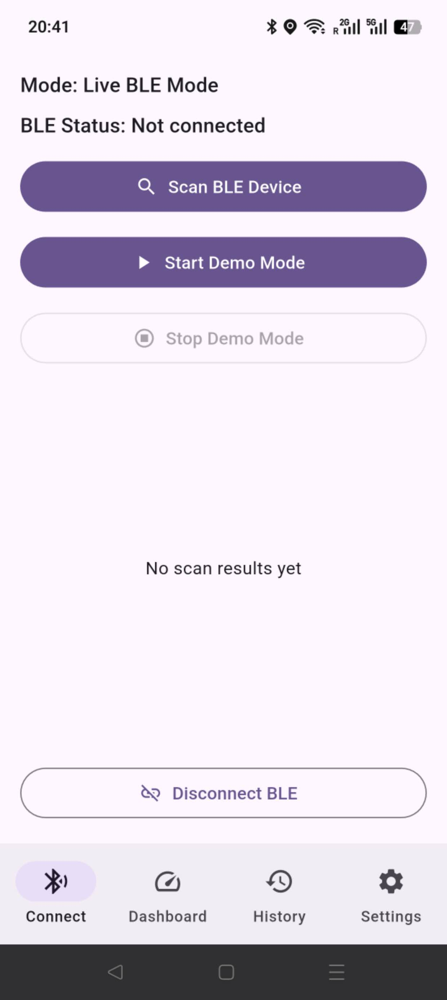

# CASA0015 – Indoor Air Quality Monitoring System

## 📱 Overview

This project presents a **mobile-based indoor air quality (IAQ) monitoring system**, combining embedded sensing (Arduino), wireless communication (Bluetooth Low Energy), and cloud storage (Firebase).

The system continuously measures:

* **eCO₂ (ppm)** – indicator of ventilation quality
* **TVOC (ppb)** – indicator of air pollutants

These measurements are transmitted to a Flutter mobile application, where they are visualised in real time and stored for historical analysis.

---

## 🧠 Application Functionality

The mobile application is designed as a **complete end-to-end monitoring interface**, supporting device connection, real-time feedback, and long-term data analysis.

### 🔍 1. Device Discovery & Connection

The app scans for nearby BLE devices and allows users to connect to the IAQ sensor.

* Displays available devices with signal strength (RSSI)
* Supports reconnect and disconnect workflows
* Ensures continuous data streaming once connected

📸 
<p align="center">
  
</p>


---

### 📊 2. Real-Time Air Quality Dashboard

The dashboard provides **live visual feedback** of environmental conditions.

* Displays:

  * eCO₂ (ppm)
  * TVOC (ppb)
* Uses gauge-style visualisation for intuitive understanding
* Applies threshold-based classification:

  * **Good**
  * **OK**
  * **Bad**

This allows users to quickly assess indoor air quality without interpreting raw numbers.

📸 *(Insert screenshot: Dashboard with gauges here)*

---

### 🕓 3. Historical Data Tracking

All readings are stored and can be reviewed in the history view.

* Displays time-stamped records
* Supports continuous monitoring over time
* Enables users to identify trends and anomalies

📸 *(Insert screenshot: History page here)*

---

### ⚙️ 4. Custom Threshold Settings

Users can configure air quality thresholds:

* Adjustable limits for eCO₂ and TVOC
* Stored locally on device
* Immediately reflected in dashboard classification

📸 *(Insert screenshot: Settings page here)*

---

## 🔄 Data Flow & System Behaviour

The system follows this pipeline:

```text
Sensor (SGP30)
   ↓
Arduino
   ↓ (BLE)
Flutter App
   ↓
Firebase Firestore
```

* Sensor readings are generated on the embedded device
* Data is transmitted via BLE
* The app processes and visualises the data
* Data is optionally stored in Firebase for persistence

---

## ☁️ Firebase Integration

The application uses **Cloud Firestore** as a backend database.

### Stored Data Structure

Each reading includes:

* `eco2` – CO₂ level
* `tvoc` – VOC level
* `deviceTime` – timestamp from device
* `receivedAt` – server timestamp
* `status` – computed classification

### Purpose

* Persistent storage across sessions
* Enables history access without requiring active BLE connection
* Provides a cloud-based record for analysis and evaluation

📸 *(Insert screenshot: Firebase console data view here)*

---

## 🧪 System Robustness & Hardware Independence
<strong style="color:red;">
This fallback mechanism is exposed in the interface as a testing/demo mode,  
allowing users to explore the application without requiring a physical device.
</strong>

To ensure the application remains **fully testable in all environments**, the system supports an alternative data source when physical hardware is unavailable.

### Behaviour

* The app dynamically selects its data stream:

  * **Primary**: BLE sensor input
  * **Fallback**: internally generated data stream

* The fallback data mimics realistic sensor behaviour:

  * Continuous updates
  * Valid ranges for eCO₂ and TVOC
  * Compatible with all UI components

### Motivation

This design ensures:

* The application can be evaluated without requiring Arduino hardware
* All features (dashboard, history, Firebase storage) remain functional
* Consistent user experience across testing scenarios

---

## 📁 Project Structure

### Arduino（mobile_app.ino)
* sensor layer
* Reads SGP30 sensor values
* Sends data via BLE

---

### Flutter Application (`mobile_app_flutter/`)

#### `ble/`

* BLE communication and data parsing

#### `models/`

* Data structures (IAQ readings, thresholds)

#### `pages/`

* UI screens:

  * Connection
  * Dashboard
  * History
  * Settings

#### `services/`

* Firebase integration
* Data stream management

#### `storage/`

* Local persistence (threshold settings)

#### `main.dart`

* App entry point
* Handles navigation and data source switching

---

## 🚀 Running the Application

```bash
flutter pub get
flutter run
```

* Connect to BLE device for live data
* If unavailable, the app still operates using internal data stream

---

## 📌 Notes

* BLE functionality requires device permissions
* Firebase is configured in development mode
* The system is designed for both real-world deployment and evaluation scenarios

---

## 👨‍💻 Author

Wu Yitong
CASA0015 – Connected Environments
